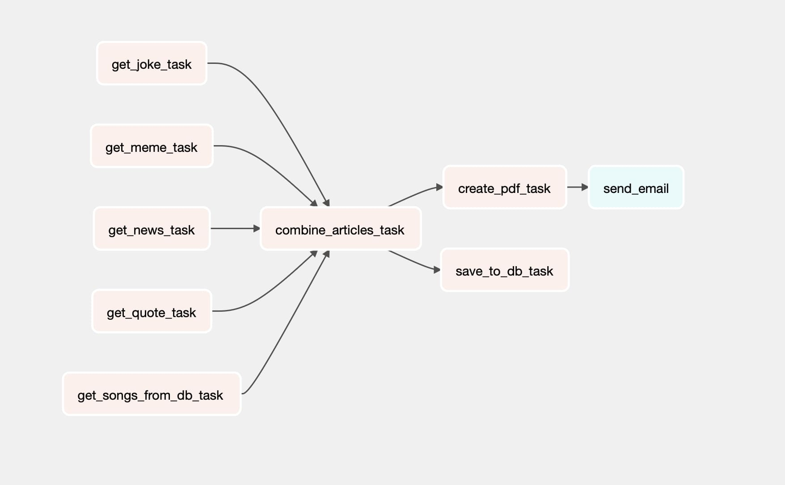

# Cereal Letter


A daily letter composed of jokes, news, a deep quote and some good song suggestions by the @akashjkhamkar himself

### Motivation

Motivation behind this project was to understand how the ETL pipelines work and learn how frameworks such airflow and argo are used


### Stack

airflow, mongodb, postgres, docker

### Working

Our airflow DAG looks something like this

first we fetch the information from various open apis

we later combine this info together, and save the json data inside mongodb for safekeeping

and we generate the pdf using the data, and send it to the user



### How to launch ?

simple docker-compose up will kickstart all of the services

then visit [http://localhost:8080](http://localhost:8080) to open the airflow console

there you can trigger the DAG cereal-letter

```yaml
docker-compose up
```

### Pdfs

pdfs get stored in the /temp folder

### Env

to enable emails, you will need to configure your [sendgrid.com](http://sendgrid.com) account.

after setting it up, add the email and the api key in the .env file

then the email operator should succeed

### Future scope

Multiple users should be able to subscribe to the letter, and all should get a letter customised to their own preferences